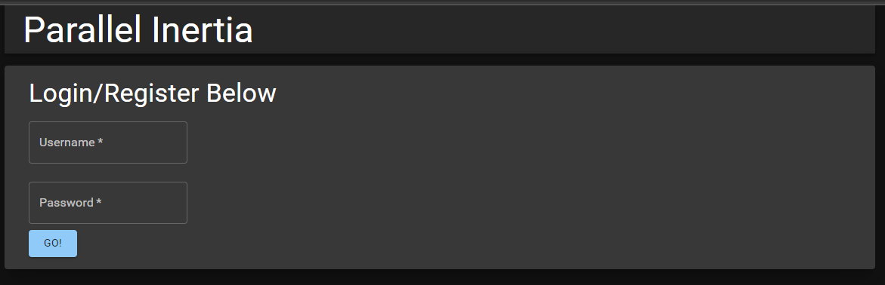
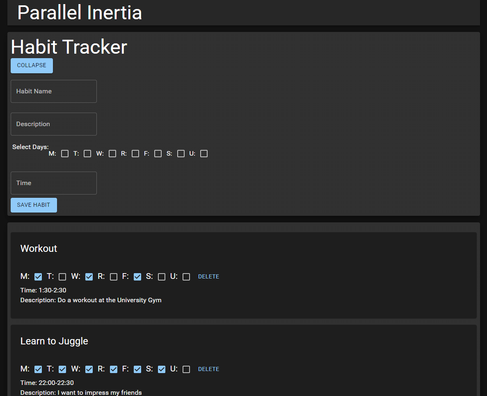

# Team Parallel Inertia

## The Parallel Inertia Habit-Tracking app

### Goal

The goal of our habit tracking app is to increase productivity by allowing the user to have all of their good habits in one place. This allows the user to easily be reminded of things they want to do and should increase the effectivity of their habit-making.

### Description

The Parallel Inertia Habit-Tracking app is a web application created with Nodejs, Express, React, and MongoDB. It consists of a front-end where the user can log in, add new habits, and track current habits. The backend handles the log-in authentication, cookie handling, and database CRUD operations to store the user's habits.

### Frontend

The front end of the app consists of two pages:

#### Login Page

The login page is where the user creates an account or logs in to their existing account. The user submits their username and password, and they are sent to the backend for validation. A screenshot of the clean login design is shown below:

#### Home Page

The home page is where the user will spend most of their time on the app. There is a form to create a new habit, as well as a place to view all of the user's habits, and check off if they were completed or not. Each habit has a Name, Description, Days of the week, and Time field, to remind the user when they plan on reinforcing their habits. The user can also check off boxes like a checklist to keep track of what they have done in the past week. A screenshot of the home page is shown below:

### Backend

### Shortcomings/Bugs

### Installation Instructions

To run the server locally, clone this repository. When in the repo, run '''yarn''' in the main folder and run '''yarn''' in the /client folder. This installs the dependencies. Next, when in the main repository folder, run '''yarn start''' to run the server and client concurrently. Then, a browser will open where you can try the app. you can also navigate to http://localhost:3000/login to see the login page.

### Future Development

In the future, we would like to have the application send notifications to the user when it is their time to do the habit. For example, the user would be reminded to work out on Monday, Wednesday, and Friday if that's how they set up their habit.
